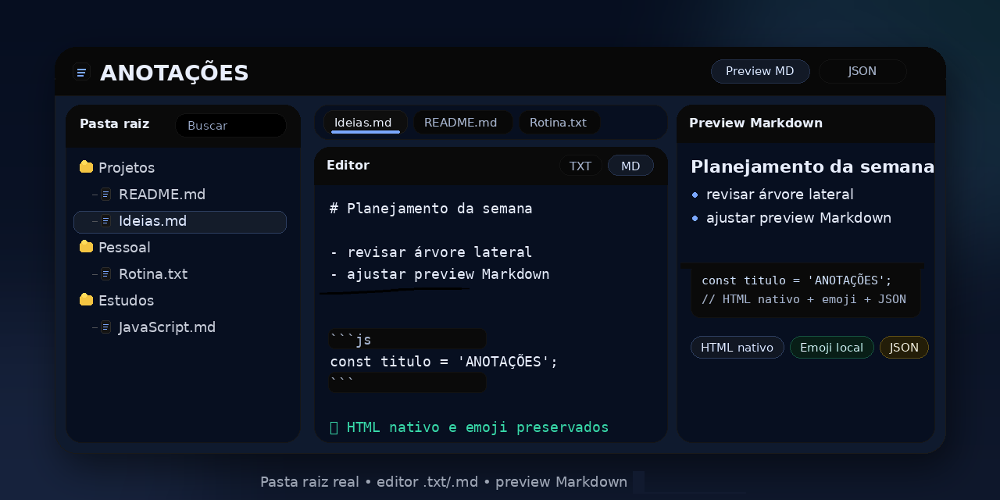

# ANOTAÇÕES


Workspace web **local-first** para **organizar uma pasta real do computador** e editar **arquivos `.txt` e `.md` reais** com **abas**, **busca alternável por nome ou nome+conteúdo**, **preview Markdown**, **autosave**, **personalização visual** e **backup/importação em JSON**.

> **Segurança documentada:** este repositório inclui o relatório técnico [PENTEST-REPORT.md](./PENTEST-REPORT.md), com resumo executivo, escopo, metodologia, achados principais, matriz resumida de risco, reteste e parecer final da versão atual.

> **Security / Trust / Hardening**
> - arquivos `.txt` e `.md` reais em pasta real do computador
> - arquitetura **local-first** sem backend obrigatório como requisito central
> - fluxo com **autorização manual** para acesso à pasta raiz
> - abertura inicial da pasta em **modo leitura**, com escrita solicitada só em ações mutáveis
> - revisão de segurança com **reteste após hardening**
> - documentação técnica separada para avaliação do estado atual



> Uma proposta simples e direta: usar o navegador como interface para trabalhar sobre **arquivos reais**, sem prender suas anotações a um formato proprietário, banco interno obrigatório ou backend como requisito central.

---

## Sumário

- [O que é](#o-que-é)
- [Sinais de confiança](#sinais-de-confiança)
- [Por que este projeto é diferente](#por-que-este-projeto-é-diferente)
- [Recursos principais](#recursos-principais)
- [Casos de uso](#casos-de-uso)
- [Comparação com projetos similares](#comparação-com-projetos-similares)
- [Como funciona](#como-funciona)
- [Compatibilidade](#compatibilidade)
- [Privacidade e comportamento](#privacidade-e-comportamento)
- [Segurança e pentest](#segurança-e-pentest)
- [Estrutura do repositório](#estrutura-do-repositório)
- [Como usar](#como-usar)
- [Limitações conhecidas](#limitações-conhecidas)
- [Licença e atribuições](#licença-e-atribuições)

---

## O que é

**ANOTAÇÕES** não foi pensado como apenas mais um editor Markdown no navegador.

A proposta do projeto é transformar uma **pasta raiz real do computador** em um workspace web de escrita, revisão e organização, mantendo o conteúdo em **arquivos `.txt` e `.md` reais**.

Na prática, isso significa combinar em uma única interface:

- **árvore de pastas e arquivos reais**
- **múltiplas abas**
- **busca por nome e conteúdo, com alternância de modo**
- **edição direta de texto e Markdown**
- **preview Markdown integrado**
- **backup/importação em JSON**
- **preferências locais de aparência e uso**

O resultado é uma aplicação web estática com perfil de **workspace local-first**, pensada para quem quer mais ergonomia do que um editor simples, sem abrir mão do controle sobre os próprios arquivos.

---

## Sinais de confiança

É importante deixar claro **como o projeto se comporta**, **quais premissas de segurança ele assume** e **que tipo de revisão já foi feita**.

| Pilar | O que isso sinaliza na prática |
|---|---|
| **Arquivos reais** | O conteúdo não fica preso a um formato proprietário nem a um banco interno obrigatório. |
| **Local-first** | O projeto prioriza o computador do usuário como base do fluxo, reduzindo dependências externas. |
| **Autorização manual** | O acesso à pasta raiz depende de ação explícita do usuário, alinhando o fluxo ao princípio de menor surpresa. |
| **Menor privilégio** | A pasta é aberta primeiro em leitura e a escrita só é pedida quando a ação realmente precisa modificar o disco. |
| **Pentest documentado** | Existe material técnico dedicado para revisão, leitura crítica e validação do estado atual. |
| **Reteste após hardening** | O relatório não fica apenas na teoria: ele registra nova verificação depois das correções aplicadas. |

Este não é apenas um protótipo visual interessante, mas uma aplicação com preocupação concreta com **portabilidade, previsibilidade e hardening compatível com sua proposta arquitetural**.

---

## Por que este projeto é diferente

### 1. Trabalha com pasta real, não com storage fechado
A base do fluxo é uma **pasta raiz escolhida manualmente pelo usuário**. A árvore lateral representa arquivos e pastas reais do computador, o que melhora portabilidade, backup externo, interoperabilidade e transparência sobre onde os dados estão.

### 2. O conteúdo continua sendo seu
O projeto trabalha com **`.txt` e `.md` reais**, em vez de aprisionar tudo em um formato interno. Isso facilita abrir, mover, versionar, copiar ou reaproveitar o mesmo conteúdo em outras ferramentas.

### 3. Vai além de “editor + preview”
O **ANOTAÇÕES** reúne recursos que, juntos, o aproximam mais de um workspace leve do que de um editor web básico:

- árvore lateral de arquivos e pastas
- múltiplas abas
- reordenação, fixação e reabertura de abas
- abertura rápida das anotações diretas de uma pasta
- busca com alternância entre **nome** e **nome + conteúdo**
- autosave opcional
- personalização visual local
- exportação/importação de estrutura em JSON

### 4. Markdown forte sem abandonar o fluxo local-first
O preview foi pensado para um uso real de documentação e anotações técnicas, com suporte a:

- **HTML nativo dentro do Markdown**
- **emoji local**
- **blocos de código com destaque de sintaxe**
- **task lists**
- **footnotes**
- **fórmulas com KaTeX**

---

## Recursos principais

- abertura manual de **pasta raiz real**
- navegação em **árvore de pastas e arquivos reais**
- criação de arquivos `.txt` e `.md`
- criação, renomeação, exclusão e movimentação de pastas e arquivos
- reordenação manual de abas e da árvore
- edição direta de texto puro e Markdown
- **abas para múltiplos arquivos**
- fixação, reabertura e fechamento em lote de abas
- preview Markdown integrado
- suporte a **HTML nativo dentro do Markdown**
- destaque de sintaxe para código
- suporte a **KaTeX**, **task lists** e **footnotes**
- busca por **nome** ou **nome + conteúdo**
- autosave opcional
- atalhos de teclado
- personalização de aparência da árvore e do editor
- exportação da pasta raiz para JSON
- importação de JSON recriando a estrutura real
- restauração de preferências e estados auxiliares locais

---

## Casos de uso

O projeto pode ser especialmente útil para quem quer:

- organizar notas em **pastas reais do computador**
- editar **`.txt` e `.md`** com mais conforto e contexto visual
- manter um fluxo **local-first** sem backend obrigatório
- usar uma ferramenta leve para **documentação, estudo, rascunhos e anotações técnicas**
- explorar uma interface web baseada em **File System Access API**
- publicar uma demo funcional em **GitHub Pages**

Também é uma proposta interessante para buscas como:

- **editor Markdown local-first**
- **workspace web para arquivos `.md` e `.txt`**
- **organizador de notas em pasta local**
- **aplicação web estática para editar arquivos reais no navegador**

---

## Comparação com projetos similares

Esta comparação não existe para alegar equivalência total ou cópia direta. Ela serve para contextualizar o **ANOTAÇÕES** dentro de uma família de ferramentas próximas.

| Projeto | Link | Onde se aproxima | Diferença principal |
|---|---|---|---|
| **ANOTAÇÕES** | **Este repositório** | Workspace web local-first para **pasta real do computador**, com **arquivos `.txt` e `.md` reais**, **árvore lateral**, **abas**, **busca**, **preview Markdown**, **personalização visual** e **backup/importação em JSON**. | A proposta central é transformar uma **pasta real** em um espaço de trabalho de escrita, revisão e organização no navegador, sem backend obrigatório. |
| **Noted** | [github.com/thomasgauvin/noted](https://github.com/thomasgauvin/noted) | Também trabalha direto no **filesystem local**, com organização em pastas e edição de notas Markdown. | O foco público do projeto é mais claramente o de **markdown note-taking app**. |
| **Impossible-Writer** | [github.com/clarkezyz/Impossible-Writer](https://github.com/clarkezyz/Impossible-Writer) | Compartilha a proposta de **privacidade**, **portabilidade** e trabalho no navegador com conteúdo local. | O diferencial principal dele é **colaboração em tempo real**, com posicionamento mais forte como editor colaborativo. |
| **mdSilo Web** | [github.com/danloh/mdSilo-web](https://github.com/danloh/mdSilo-web) | É próximo na ideia de base de conhecimento **local-first** sobre arquivos plain-text no navegador. | Na versão web, o próprio projeto informa limitações como **ausência de folder management**, o que o distancia da proposta central do **ANOTAÇÕES**. |
| **Markdown++** | [github.com/emir/markdown-plus-plus](https://github.com/emir/markdown-plus-plus) | Também conecta o navegador ao **filesystem local** e oferece browser de arquivos, edição e organização. | O foco principal é funcionar como **painel/CMS para static site generators**, com Git/GitHub/GitLab como parte importante da proposta. |
| **mark** | [github.com/Etschmia/mark](https://github.com/Etschmia/mark) | Se aproxima por ser um editor web que trabalha com **arquivos locais** sem backend obrigatório. | A apresentação pública dele é mais enxuta e mais centrada em **edição Markdown**, sem destacar o mesmo pacote de workspace estrutural. |
| **Markpad** | [github.com/kr3t3n/markpad](https://github.com/kr3t3n/markpad) | Se aproxima no eixo **local-first**, **offline** e foco em escrita no navegador. | O armazenamento principal é **IndexedDB no navegador**, e não uma **pasta real do computador** como base do fluxo. |

### Leitura rápida da comparação

O diferencial do **ANOTAÇÕES** está na combinação destes blocos dentro da mesma aplicação:

- **pasta raiz real do computador**
- **arquivos `.txt` e `.md` reais**
- **árvore lateral e múltiplas abas**
- **busca por nome e conteúdo**
- **preview Markdown forte**
- **personalização visual**
- **backup/importação JSON**
- **fluxo local-first sem backend obrigatório**

---

## Como funciona

A experiência foi desenhada para uso prático no desktop:

1. o usuário abre a página
2. autoriza manualmente uma **pasta raiz real**
3. a árvore lateral passa a refletir essa estrutura
4. arquivos `.txt` e `.md` podem ser abertos em abas
5. a edição acontece no centro da interface
6. o preview Markdown ajuda na revisão visual
7. busca, abas, preferências e backup tornam o uso contínuo mais confortável

Esse fluxo é interessante para quem quer unir **simplicidade de arquivo local** com **ergonomia de interface web**.

---

## Compatibilidade

| Navegador | Situação |
|---|---|
| Chrome desktop | recomendado |
| Edge desktop | recomendado |
| Brave | pode funcionar com limitações ou comportamento inconsistente |
| Firefox | suporte limitado ou incompatível para a integração principal com pasta raiz |

Pontos importantes:

- o recurso central de pasta raiz depende da **File System Access API**
- para uso confiável, prefira **Chrome ou Edge no desktop**
- em ambiente público, a autorização da pasta deve ser **manual**
- se a pasta for alterada fora da página, pode ser necessário **atualizar a árvore**
- o projeto foi pensado para **desktop**, não para fluxo mobile-first

---

## Privacidade e comportamento

- As anotações principais ficam em **arquivos reais `.txt` e `.md`** dentro da pasta escolhida pelo usuário.
- O projeto foi preparado para funcionar **sem backend obrigatório**.
- Em modo público endurecido no GitHub Pages, a página **não tenta lembrar a pasta raiz** entre aberturas.
- O app **não persiste `FileSystemHandle` entre sessões**, reduzindo o impacto potencial em cenários de abuso do navegador.
- Dados auxiliares de **árvore, abas abertas e abas fechadas** priorizam armazenamento de **sessão**; preferências visuais, autosave e alguns estados de interface podem ser guardados localmente pelo navegador.
- Para uso público, o usuário precisa **autorizar manualmente** a pasta raiz.
- Quando a ordem manual da árvore precisa ser preservada em disco, o app pode criar um arquivo auxiliar **`.anotacoes-order.json`** dentro da pasta real afetada.

### O que isso significa na prática

- o conteúdo principal continua em **arquivos reais**, não em um banco proprietário do app
- a experiência pode restaurar preferências de uso sem tentar “tomar posse” permanente da pasta do usuário
- a ordem visual personalizada da árvore pode depender do arquivo auxiliar `.anotacoes-order.json`

---

## Segurança e pentest

Além da documentação funcional, o projeto também inclui um relatório técnico específico de segurança:

- [PENTEST-REPORT.md](./PENTEST-REPORT.md) — relatório de pentest estático e revisão lógica de segurança do `index.html`

### O que o relatório cobre

- análise de **CSP** e endurecimento compatível com o modelo single-file
- avaliação de **XSS** e sanitização do preview Markdown
- validação do uso de **DOMPurify**, **KaTeX** e emoji local
- revisão do fluxo de **File System Access** com foco em **menor privilégio**
- análise de persistência local, superfície de rede e impacto operacional da sessão ativa
- registro de **reteste** após as correções de hardening

### Leitura rápida do parecer

De acordo com o relatório, a versão atual foi considerada **aprovada para o contexto do projeto**, com uma **ressalva estrutural formal**: a Content Security Policy é aplicada por **meta tag**, e não por **header HTTP real**.

Na prática, isso reforça sinais importantes para quem avalia o repositório:

- existe preocupação explícita com **segurança aplicada**, não apenas com funcionalidades
- as correções foram **retestadas** após o endurecimento do arquivo principal
- o projeto preserva a proposta **local-first** sem abandonar critérios técnicos de mitigação e revisão
- o fluxo abre a pasta em **modo leitura** e só pede escrita em salvar, mover, renomear, deletar, importar e persistir ordem manual
- o preview Markdown passa por **sanitização** antes da inserção final no DOM
- a superfície de rede foi reduzida com comportamento **offline-first** para emoji e fechamento de `connect-src`

Esse material é especialmente útil para quem deseja entender melhor o nível de hardening atual do app antes de estudar, adaptar, publicar ou evoluir o projeto.

---

## Estrutura do repositório

```text
.
├─ index.html
├─ social-preview.png
├─ README.md
├─ PENTEST-REPORT.md
├─ LICENCAS-E-ATRIBUICOES.md
├─ CMD_Leia_abrir-pagina-localmente.txt
├─ abrir_html_local_py.bat
├─ abrir_html_local_shell.bat
└─ libs/
   ├─ dompurify.min.js
   ├─ emojis.js
   ├─ github-markdown.css
   ├─ fonts/
   │  ├─ KaTeX_*.ttf / .woff / .woff2
   │  └─ ... (arquivos de fonte do KaTeX)
   ├─ highlight.min.css
   ├─ highlight.min.js
   ├─ katex.min.css
   ├─ katex.min.js
   ├─ markdown-it-footnote.min.js
   ├─ markdown-it-katex.min.js
   ├─ markdown-it-task-lists.min.js
   └─ markdown-it.min.js
```

> Observação: durante o uso com pasta real, o app pode criar **`.anotacoes-order.json`** dentro de pastas do usuário para persistir a ordem manual da árvore. Esse arquivo é de runtime e não faz parte do conteúdo fixo do repositório.

---

## Como usar

Você pode usar o projeto de duas formas:

### 1) Publicação estática em GitHub Pages / HTTPS
Boa opção para demonstrar a interface, compartilhar o projeto e disponibilizar a aplicação publicamente.

### 2) Execução local em localhost
Boa opção para testes, validação e comportamento mais previsível da integração com pasta raiz.

Arquivos auxiliares incluídos no repositório:

- `abrir_html_local_shell.bat`
- `abrir_html_local_py.bat`
- `CMD_Leia_abrir-pagina-localmente.txt`

> Esses arquivos são auxiliares para abertura local e não são obrigatórios para a publicação do site estático.

### Fluxo rápido de uso

1. abra o `index.html` em **Chrome** ou **Edge** no desktop
2. clique em **Escolher pasta raiz**
3. autorize a pasta real que será usada como workspace
4. crie ou abra arquivos `.txt` e `.md`
5. salve com **Ctrl+S** ou ative o **Autosave**
6. use **Atualizar árvore** quando fizer mudanças fora da página
7. exporte para **JSON** antes de mudanças grandes ou migrações

---

## Limitações conhecidas

- o fluxo principal depende da **File System Access API**
- a experiência ideal é **desktop-first**
- o suporte entre navegadores não é uniforme
- a autorização da pasta precisa ser feita manualmente pelo usuário
- alterações externas na pasta podem exigir atualização da árvore na interface
- a preservação da ordem manual da árvore em disco depende do arquivo auxiliar **`.anotacoes-order.json`**
- a CSP atual usa **meta tag**, não **header HTTP real**

Essas limitações não anulam a proposta do projeto; elas apenas deixam claro o contexto ideal de uso e o nível real de hardening esperado para a arquitetura adotada.

---

## Licença e atribuições

O **código autoral deste repositório** está licenciado sob a **MIT License**.

Isso permite usar, estudar, modificar e redistribuir o código, desde que o aviso de copyright e o texto da licença sejam mantidos.

As bibliotecas, os estilos e os demais arquivos de terceiros distribuídos em `libs/` **mantêm suas licenças originais** e **não são relicenciados automaticamente** pela MIT do projeto autoral.

Este projeto integra componentes voltados a:

- sanitização HTML
- parsing Markdown
- fórmulas matemáticas
- destaque de sintaxe
- estilo visual para Markdown

Arquivos de referência:

- [LICENSE](./LICENSE) — licença do **código autoral**
- [LICENCAS-E-ATRIBUICOES.md](./LICENCAS-E-ATRIBUICOES.md) — inventário, créditos e orientação prática de redistribuição dos **componentes de terceiros**

---

## Fechamento

Se a ideia é ter um **editor Markdown local-first**, mas com estrutura mais próxima de um **workspace web para pasta real**, o **ANOTAÇÕES** ocupa um espaço interessante: simples na arquitetura, prático no uso, transparente no tratamento dos arquivos e mais sólido na apresentação pública por documentar também seu estado atual de segurança e comportamento real de runtime.
