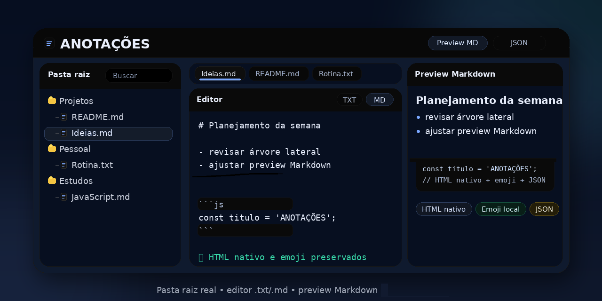

# ANOTAÇÕES


**ANOTAÇÕES** é um workspace web **local-first** para organizar uma **pasta real do computador** e editar arquivos **`.txt`** e **`.md`** reais pelo navegador, com árvore lateral, abas, busca, preview Markdown avançado, personalização visual e backup/importação em JSON.

## Abra e teste agora 🚀

Acesse a versão publicada em GitHub Pages:

**https://diego-ch4m4x.github.io/ANOTACOES/**

Clique no link acima, abra a página em **Chrome ou Edge no desktop**, escolha uma pasta raiz do seu computador e teste o fluxo real: criar notas, abrir arquivos `.md`, alternar entre editor e preview, usar abas, buscar conteúdo e personalizar a interface. A proposta é simples: transformar uma pasta comum do seu PC em um ambiente visual de anotações, estudo e documentação.



> **Nota de segurança:** este projeto manipula arquivos reais da pasta escolhida pelo usuário. Use com uma pasta de teste na primeira execução e faça backup antes de operações grandes de importação, movimentação, renomeação ou exclusão.

---

> **Atualização v1.0.13:** incorpora o núcleo de desempenho e integridade homologado no VIVO NOTE v1.0.23: Fast Root Attach, handles lazy, MOVE/RENAME incremental, baseline físico pós-operação, normalização de extensão e Save com readback. A primeira indexação sem cache continua podendo demorar em raízes grandes; o ganho principal ocorre nas reconexões e operações estruturais subsequentes.

## Sumário

- [O que é](#o-que-é)
- [Principais recursos](#principais-recursos)
- [Atalhos de teclado](#atalhos-de-teclado)
- [Preview Markdown avançado](#preview-markdown-avançado)
- [Como usar no GitHub Pages](#como-usar-no-github-pages)
- [Como usar localmente](#como-usar-localmente)
- [Compatibilidade](#compatibilidade)
- [Privacidade e armazenamento](#privacidade-e-armazenamento)
- [Decisões técnicas de armazenamento](#decisões-técnicas-de-armazenamento)
- [Segurança e hardening](#segurança-e-hardening)
- [Limitações conhecidas](#limitações-conhecidas)
- [Estrutura do repositório](#estrutura-do-repositório)
- [Licença e atribuições](#licença-e-atribuições)

---

## O que é

O **ANOTAÇÕES** não é apenas um editor de texto dentro do navegador. Ele foi desenhado como um **workspace local-first** para trabalhar em cima de uma **pasta raiz real** escolhida pelo usuário.

Na prática, a aplicação permite:

- escolher uma pasta real do computador;
- listar pastas e arquivos compatíveis em uma árvore lateral;
- criar, abrir, editar, renomear, mover e excluir arquivos `.txt` e `.md`;
- trabalhar com várias notas abertas em abas;
- visualizar Markdown renderizado sem abandonar o fluxo local;
- exportar/importar a estrutura em JSON;
- personalizar cores, fontes, tamanhos e opções de exibição.

A ideia central é manter suas anotações em arquivos simples, portáveis e fáceis de versionar, sem obrigar o uso de banco de dados, login, backend ou formato proprietário.

---

## Principais recursos

### Arquivos e pastas reais

- Seleção manual de **pasta raiz** pelo navegador.
- Suporte a arquivos **`.txt`** e **`.md`**.
- Criação de notas e pastas pela interface.
- Renomeação, exclusão e movimentação por botões, atalhos ou menu contextual.
- Atualização da árvore quando arquivos forem modificados fora da página.
- Persistência de ordem manual da árvore no **IndexedDB**, sem criar arquivo auxiliar `.anotacoes-order.json` dentro das pastas reais.
- **Primeira sincronização:** quando ainda não existe snapshot local, a aplicação precisa indexar fisicamente a raiz; em pastas grandes ou em rede essa etapa pode levar vários minutos.
- **Fast Root Attach:** nas próximas aberturas da mesma raiz, com os dados do navegador preservados, a árvore conhecida é restaurada do snapshot e os `FileSystemHandle` descendentes são resolvidos sob demanda.
- **Atualizar árvore** continua sendo a reconciliação física completa para descobrir arquivos/pastas criados, removidos, movidos ou renomeados fora da aplicação.
- **Move/Rename incremental:** após uma operação física bem-sucedida, somente a subárvore afetada é reconciliada; um full resync fica reservado para fallback de segurança.
- **Save verificado:** após `write()` + `close()`, o arquivo é relido e o estado “Salvo ✅” só é confirmado se o conteúdo persistido for exatamente igual ao editor.

### Interface de workspace

- Árvore lateral com pastas e arquivos.
- Menu contextual na árvore.
- Abas múltiplas para arquivos abertos.
- Fixação, reordenação e reabertura de abas fechadas.
- Fechamento individual, fechamento das outras abas e fechamento em lote.
- Barra de abas com navegação lateral e opção de quebra em múltiplas linhas.
- Cabeçalho e árvore recolhíveis.
- Indicadores visuais de estado salvo/não salvo.
- Overlay de sincronização para bloquear a interface durante operações longas na pasta raiz.

### Busca e produtividade

- Busca alternável entre **nome** e **nome + conteúdo**.
- Destaque visual de ocorrências.
- Busca dentro de arquivos `.txt` e `.md` lidos da pasta escolhida.
- Atalhos de teclado para salvar, criar nota, criar pasta, renomear, excluir, alternar Markdown, navegar por abas, personalizar a interface e abrir informações; veja a seção [Atalhos de teclado](#atalhos-de-teclado).
- Autosave opcional.
- Botão de voltar ao topo no preview Markdown.

### Personalização visual

O painel **Personalização** permite ajustar a experiência sem editar código:

- fundo e texto da árvore;
- fonte da árvore;
- tamanho da fonte da árvore;
- cor do ícone de pasta;
- cor e espessura das linhas da árvore;
- fundo e texto do editor/preview;
- fonte e tamanho do editor;
- quebra de linha no editor/preview;
- quebra de abas em múltiplas linhas;
- restauração dos valores padrão.

---

## Atalhos de teclado

Os atalhos abaixo fazem parte do fluxo principal da aplicação e foram pensados para uso em desktop. Eles funcionam sobre a árvore, abas, editor e preview respeitando o contexto ativo da interface.

> **Nota sobre macOS:** internamente, a aplicação trata o modificador principal como `Ctrl` no Windows/Linux e como `Cmd` no macOS quando aplicável. Na documentação abaixo, `Ctrl` representa esse modificador principal.

### Regras de contexto dos atalhos

- **F2** renomeia o item correto conforme o contexto: item focado na árvore, arquivo ativo no editor, arquivo ativo no preview ou aba ativa.
- Atalhos destrutivos como **Ctrl+Del** e **Alt+Del** usam o mesmo critério de alvo ativo para evitar excluir um item antigo selecionado por engano.
- Atalhos globais são bloqueados em campos de formulário, busca e diálogos quando isso poderia interromper digitação normal.
- Em modais abertos, **Esc** fecha o diálogo quando permitido e **Tab** permanece preso dentro do modal para preservar acessibilidade básica de foco.
- Em arquivos Markdown, **Ctrl+Alt+E** alterna entre modo de edição e preview somente quando a aba ativa é `.md`.

### Tabela de atalhos

| Área | Atalho | Ação | Observações |
|---|---|---|---|
| Busca | `Ctrl+K` | Focar o campo de busca | Seleciona o conteúdo atual da busca quando possível. |
| Busca | `Esc` | Limpar busca ativa | Funciona quando o foco está no campo de busca e há texto digitado. |
| Arquivo atual | `Ctrl+S` | Salvar arquivo ativo | Preserva o fluxo local-first; em arquivos reais, grava no disco conforme permissão do navegador. |
| Árvore / arquivo ativo | `F2` | Renomear item ativo | Funciona para item focado na árvore, arquivo aberto no editor, preview ou aba ativa. |
| Árvore / arquivo ativo | `Ctrl+Del` | Excluir item ativo | Usa o alvo ativo/selecionado. Operação destrutiva em arquivo real quando a versão com API está em uso. |
| Árvore / arquivo ativo | `Alt+Del` | Excluir item ativo | Alternativa ao `Ctrl+Del`, com a mesma regra de alvo ativo. |
| Árvore | `Ctrl+Alt+S` | Criar pasta | Cria no contexto da pasta ativa, da pasta do arquivo ativo ou da raiz quando aplicável. |
| Árvore | `Ctrl+Alt+D` | Criar anotação | Cria nota no contexto ativo da árvore ou da aba atual. |
| Árvore | `Ctrl+Alt+←` | Retrair árvore lateral | Recolhe a sidebar para ganhar área de edição. |
| Árvore | `Ctrl+Alt+→` | Expandir árvore lateral | Restaura a sidebar. |
| Cabeçalho | `Ctrl+Alt+↑` | Retrair topo/cabeçalho | Reduz a área ocupada pelo cabeçalho. |
| Cabeçalho | `Ctrl+Alt+↓` | Expandir topo/cabeçalho | Restaura o cabeçalho. |
| Abas | `Ctrl+W` | Fechar aba atual | Abas fixadas não são fechadas até serem desfixadas. |
| Abas | `Ctrl+Shift+W` | Fechar aba atual | Alternativa aceita pelo fluxo atual. |
| Abas | `Ctrl+Tab` | Alternar para próxima aba | Com `Shift`, alterna para a aba anterior. |
| Abas | `Ctrl+Shift+1` | Ativar aba à esquerda | Navega relativamente à aba ativa. |
| Abas | `Ctrl+Shift+2` | Ativar aba à direita | Navega relativamente à aba ativa. |
| Abas | `Ctrl+Shift+←` | Mover aba ativa para a esquerda | Mantém abas fixadas e não fixadas em seus respectivos grupos. |
| Abas | `Ctrl+Shift+→` | Mover aba ativa para a direita | Mantém abas fixadas e não fixadas em seus respectivos grupos. |
| Abas | `Ctrl+Shift+T` | Reabrir aba fechada | Reabre a última aba fechada quando houver histórico disponível. |
| Abas | `Ctrl+Alt+Shift+T` | Reabrir aba fechada | Alternativa aceita pelo fluxo atual. |
| Markdown | `Ctrl+Alt+E` | Alternar editor/preview Markdown | Só atua quando o arquivo ativo é `.md`. |
| Interface | `Ctrl+Alt+P` | Abrir personalização | Abre o painel de ajustes visuais. |
| Interface | `Ctrl+Alt+A` | Ligar/desligar Autosave | Alterna o salvamento automático. |
| Interface | `Ctrl+Alt+I` | Abrir informações | Mostra informações do app, ambiente e atalhos. |
| Editor | `Ctrl+Alt+U` | Converter seleção para MAIÚSCULAS | Atua apenas quando há seleção válida no editor ativo. |
| Editor | `Ctrl+Alt+Y` | Converter seleção para minúsculas | Atua apenas quando há seleção válida no editor ativo. |
| Editor | `Tab` | Inserir indentação | No editor, insere tabulação ou indenta bloco selecionado. |
| Editor | `Shift+Tab` | Remover indentação | Remove tabulação/espaços iniciais quando aplicável. |
| Modais | `Esc` | Fechar modal ativo | Quando o modal permite fechamento. |
| Modais | `Tab` / `Shift+Tab` | Navegar dentro do modal | O foco permanece preso no modal aberto. |
| Árvore / abas | Setas direcionais | Navegação local | Na árvore e nas abas, as setas atuam conforme o componente focado. |
| Árvore | `Enter` / `Espaço` | Abrir/acionar item focado | Comportamento contextual do item da árvore. |
| Árvore | `Menu de contexto` / `Shift+F10` | Abrir menu de contexto | Quando suportado pelo navegador e pelo foco atual. |

### Observações de manutenção

- Ao adicionar novo atalho, documente também o comportamento esperado quando o foco estiver em: árvore, editor, preview, aba, busca e modal.
- Evite criar listeners paralelos para atalhos globais. O fluxo principal deve continuar centralizado no manipulador global de teclado para reduzir conflito entre comandos.
- Atalhos que executam ações destrutivas devem sempre resolver o alvo ativo de forma explícita antes de executar a ação.
- Atalhos que podem interferir em digitação devem respeitar campos de formulário, busca e modais.

## Preview Markdown avançado

O preview Markdown do `index.html` foi atualizado para funcionar como uma área de leitura técnica, não apenas como renderização básica.

Recursos observados no arquivo atual:

| Recurso | Como é usado no projeto |
|---|---|
| `markdown-it` | Parser Markdown principal. |
| HTML nativo no Markdown | Permitido no parser e sanitizado antes de entrar no DOM. |
| DOMPurify | Sanitização do HTML renderizado. |
| highlight.js | Destaque de sintaxe em blocos de código. |
| KaTeX | Renderização de fórmulas matemáticas. |
| Task lists | Suporte a checklists Markdown. |
| Footnotes | Suporte a notas de rodapé. |
| GitHub Alerts | Suporte visual a `> [!NOTE]`, `> [!TIP]`, `> [!IMPORTANT]`, `> [!WARNING]` e `> [!CAUTION]`. |
| `<details>` / `<summary>` | Acabamento visual para blocos expansíveis HTML dentro do Markdown. |
| Mermaid | Renderização local de diagramas em blocos ````mermaid`. |

> **Nota de manutenção sobre KaTeX:** no `index.html` atual, a renderização matemática é feita por regras próprias registradas no `markdown-it`, usando `window.katex` diretamente. Portanto, o funcionamento observado depende de `libs/katex.min.js`, `libs/katex.min.css` e das fontes em `libs/fonts/`. O arquivo `libs/markdown-it-katex.min.js` permanece listado no repositório por compatibilidade histórica, rastreabilidade de distribuição e inventário de licenças; se ele for removido fisicamente no futuro, remova também sua entrada em `LICENCAS-E-ATRIBUICOES.md`.

### Mermaid no preview

O projeto inclui `libs/mermaid.min.js` e renderiza diagramas Mermaid localmente no preview Markdown. O fluxo atual também contém tratamentos específicos para:

- renderização offline via biblioteca local;
- fallback quando a biblioteca não estiver disponível;
- sanitização do SVG gerado;
- ajuste de tamanho para evitar diagramas gigantes/desproporcionais;
- correções visuais em diagramas de estado;
- preservação de personalizações Mermaid como `classDef`, `fill`, `stroke`, `color`, `font-weight` e `font-style`;
- contraste automático quando o diagrama usa preenchimento personalizado sem cor de texto explícita.

---

## Como usar no GitHub Pages

1. Abra: **https://diego-ch4m4x.github.io/ANOTACOES/**
2. Use **Chrome** ou **Edge** no desktop.
3. Clique em **Escolher pasta raiz**.
4. Autorize uma pasta real do computador.
   - Na **primeira sincronização**, a indexação completa pode levar vários minutos em raízes grandes ou armazenadas em rede.
   - Preserve os dados locais do navegador para que as próximas aberturas da mesma raiz possam usar o snapshot/cache local.
5. Crie ou abra arquivos `.txt` e `.md`.
6. Use **Ctrl+S** para salvar ou ative o **Autosave**.
7. Use **Atualizar árvore** quando alterar arquivos fora da página.
8. Use **Exportar JSON** antes de alterações grandes ou migrações.

> Dica: para testar com segurança, comece por uma pasta nova ou uma cópia de uma pasta real.

---

## Como usar localmente

Você também pode executar o projeto localmente em `localhost`, o que costuma ser mais previsível para testes.

Arquivos auxiliares incluídos:

- `abrir_html_local_shell.bat`
- `abrir_html_local_py.bat`
- `CMD_Leia_abrir-pagina-localmente.txt`

Fluxo sugerido:

1. mantenha `index.html` e a pasta `libs/` no mesmo diretório;
2. execute um servidor local simples ou use um dos `.bat` auxiliares;
3. abra a página em `http://127.0.0.1:PORTA/index.html`;
4. escolha a pasta raiz pela interface.

Abrir diretamente por `file://` pode funcionar parcialmente, mas não é o modo mais confiável para recursos modernos ligados à File System Access API e carregamento de bibliotecas locais.

---

## Compatibilidade

| Ambiente | Situação |
|---|---|
| Chrome desktop | Recomendado. |
| Edge desktop | Recomendado. |
| Brave | Pode funcionar, mas depende das permissões e políticas do navegador. |
| Firefox | Não é recomendado para o fluxo principal de pasta raiz real. |
| Mobile | Não é o foco do projeto. |

O recurso central depende da **File System Access API**, disponível principalmente em navegadores Chromium no desktop.

---

## Privacidade e armazenamento

O conteúdo principal fica em **arquivos reais** dentro da pasta escolhida pelo usuário.

Além disso, o navegador pode armazenar dados auxiliares para melhorar a experiência:

| Local | Uso provável no projeto |
|---|---|
| Arquivos `.txt` / `.md` | Conteúdo principal das anotações. |
| `IndexedDB` | Handles da File System Access API, estado auxiliar de reativação da pasta raiz, **ordem manual da árvore** e backups locais de resiliência (como preferências/cache), sem criar arquivo de metadados dentro das pastas reais. |
| `localStorage` | Preferências, abas, autosave e cache de restauração. Na variante com File System Access API, esse cache pode incluir **snapshots do conteúdo de arquivos `.txt`/`.md`** para acelerar a reabertura. |
| `sessionStorage` | Estados temporários da sessão. |
| `.anotacoes-order.json` | Arquivos **legados** de versões antigas. Não devem ser criados pelas versões atuais. Quando encontrados, podem ser migrados para IndexedDB e removidos em modo best-effort, desde que o navegador tenha permissão. |

Pontos importantes:

- a pasta raiz precisa ser autorizada pelo usuário;
- o navegador pode pedir confirmação novamente ao reabrir ou reativar a pasta;
- limpar os dados do site no navegador pode remover preferências, sessão, handles armazenados e a ordem manual da árvore;
- a ordem manual da árvore é vinculada à **origem** do navegador: GitHub Pages, `localhost`, `127.0.0.1` e `file://` podem ter bancos separados;
- as variantes **ANOTAÇÕES (File System Access API)** e **ANOTAÇÕES_noAPI** usam namespaces de armazenamento diferentes, evitando que árvore, abas, autosave e preferências de uma variante contaminem a outra;
- o cache da variante com File System Access API pode conter cópias locais temporárias do conteúdo de `.txt`/`.md`; limpar os dados do site remove esse cache, mas não apaga os arquivos reais da pasta escolhida;
- o app não usa backend obrigatório para armazenar suas notas;
- imagens e mídias externas no Markdown podem ser carregadas pelo navegador quando a CSP e o conteúdo permitirem.

---

## Decisões técnicas de armazenamento

Esta seção registra decisões de engenharia para evitar retrabalho futuro e orientar evoluções sem quebrar o comportamento local-first.

### Ordem manual da árvore: IndexedDB, não arquivo JSON na pasta real

A ordem manual da árvore deve ser persistida no **IndexedDB** do navegador, e não em arquivos auxiliares dentro da pasta do usuário.

Decisão atual:

| Item | Decisão |
|---|---|
| Local da ordem manual da árvore | `IndexedDB` |
| Arquivo `.anotacoes-order.json` | Legado; não deve ser criado por versões atuais. |
| Migração de legados | Permitida em modo best-effort, desde que a ordem seja gravada com sucesso no IndexedDB antes da tentativa de remoção do arquivo antigo. |
| Falha ao remover legado | Não deve bloquear a aplicação. Deve ser tratada como resíduo operacional de versões antigas. |

Motivo da decisão:

- evita “sujeira” em várias pastas do usuário;
- reduz risco de versionamento acidental de metadados de interface em Git;
- separa conteúdo real (`.txt` / `.md`) de preferência visual/operacional da interface;
- mantém coerência com o uso já existente de IndexedDB para dados auxiliares do navegador.

### Como a chave de ordem é formada hoje

O projeto usa um identificador estável derivado do caminho relativo, com codificação hexadecimal baseada em UTF-8. A função central é conceitualmente equivalente a:

```js
const encodeStableFsId = (value) => {
  const bytes = new TextEncoder().encode(String(value || ""));
  let hex = "";
  for (const byte of bytes) hex += byte.toString(16).padStart(2, "0");
  return hex || "root";
};
```

Características importantes:

| Critério | Situação atual |
|---|---|
| Determinismo | Bom: o mesmo caminho gera o mesmo identificador. |
| Unicode/acentos/espaços | Bom: `TextEncoder` converte para UTF-8 antes do hex. |
| Colisão | Praticamente inexistente, porque não é hash; é representação direta dos bytes. |
| Tamanho da chave | Cresce proporcionalmente ao caminho original. |
| Complexidade | Baixa: síncrono, simples e sem dependência de Web Crypto. |

### Caminhos muito longos e limite de chave no IndexedDB

O risco teórico é: um caminho extremamente longo gera uma string hexadecimal ainda maior e, em algum limite prático do navegador, uma operação de IndexedDB poderia falhar.

Avaliação atual:

| Cenário | Avaliação |
|---|---|
| Caminhos normais de uso diário | Sem preocupação prática. |
| Caminho clássico do Windows, em torno de 260 caracteres | A chave resultante fica pequena para padrões práticos de armazenamento local. |
| Caminhos longos extremos, com dezenas de milhares de caracteres | Risco teórico, mas improvável no uso real do projeto. |
| Limite exato da chave no IndexedDB | Não deve ser assumido como contrato fixo do projeto; pode variar por implementação do navegador. |

Decisão: **não trocar agora para SHA-256 apenas por esse motivo**.

Justificativa:

- o ganho observável para o usuário é nulo no cenário atual;
- o risco prático é muito baixo;
- a solução por SHA-256 introduziria complexidade assíncrona;
- `crypto.subtle.digest()` depende de Web Crypto e de contexto suportado/seguro pelo navegador;
- abrir por `file://`, `localhost`, GitHub Pages ou outro ambiente pode ter diferenças de disponibilidade e política;
- transformar a geração de chave em `async` pode gerar cascata em leitura, gravação, migração, exportação/importação, renderização e drag/drop;
- trocar o formato da chave exigiria migração versionada para não perder ordens já salvas.

### Quando considerar SHA-256 no futuro

SHA-256 pode entrar no backlog, mas não como correção urgente.

Só considerar implementação se ocorrer pelo menos uma destas condições:

- usuário real reportar falha de IndexedDB causada por tamanho de chave;
- o projeto passar a suportar explicitamente árvores com caminhos gigantescos por design;
- houver necessidade formal de limitar o tamanho das chaves de armazenamento;
- for criada uma migração versionada e testada para trocar o esquema de chaves.

Roteiro recomendado se essa melhoria for feita no futuro:

1. **Não substituir `encodeStableFsId` diretamente** se ele também for usado para IDs de DOM ou referências internas.
2. Criar uma função separada, por exemplo `encodeStableFsStorageKey`, apenas para chaves de armazenamento.
3. Versionar o novo formato, por exemplo `fs-order-meta-v3:<scopeHash>:<pathHash>`.
4. Usar SHA-256 somente com fallback seguro para ambientes sem `crypto.subtle`.
5. Guardar metadados suficientes no valor salvo para auditoria e migração, como versão, `scope`, caminho relativo original e lista de ordem normalizada.
6. Migrar chaves antigas para as novas sem apagar dados antes de confirmar gravação bem-sucedida.
7. Testar em Chrome/Edge desktop nos modos GitHub Pages, `localhost` e abertura local direta.
8. Manter rollback ou fallback para o formato hex caso o ambiente não suporte Web Crypto de forma confiável.

Resumo da decisão atual:

| Critério | Decisão |
|---|---|
| Alterar agora para SHA-256 | Não. |
| Manter `encodeStableFsId` atual | Sim. |
| Documentar risco residual | Sim. |
| Registrar melhoria no backlog | Sim. |
| Classificação do risco | Baixo / extremo / improvável no uso atual. |

---

## Segurança e hardening

Este repositório inclui documentação específica de segurança em [PENTEST-REPORT.md](./PENTEST-REPORT.md). Esse relatório é uma revisão técnica estática/lógica do artefato e deve ser tratado como complemento de documentação, não como substituto de teste dinâmico completo, auditoria de supply chain ou validação de headers HTTP reais em produção.

Medidas e características relevantes observadas no `index.html` atual:

- **CSP via `<meta http-equiv="Content-Security-Policy">`**;
- `connect-src 'none'`, reduzindo conexões ativas iniciadas por APIs como `fetch`;
- scripts locais carregados de `./libs/`;
- CSS inline estático autorizado por hash `sha256-...` na CSP atual;
- estilos SVG gerados dinamicamente pelo Mermaid recebem `nonce="noteapp"` e a CSP mantém esse nonce **somente em `style-src`/`style-src-elem`**, porque o conteúdo desses estilos só existe em runtime e não pode ser pré-hasheado;
- script inline principal autorizado **somente por hash** `sha256-...`; o hash deve ser recalculado sempre que o conteúdo de `<script id="appInlineJs">` mudar;
- JSON-LD inline da página pública também é autorizado por hash próprio quando presente;
- bloqueio de atributos inline de script por `script-src-attr 'none'`;
- sanitização do preview Markdown com DOMPurify;
- renderização Mermaid local com sanitização do SVG resultante;
- dependências de Markdown, KaTeX, Mermaid e highlight.js distribuídas localmente;
- ausência de backend obrigatório;
- persistência da ordem manual da árvore no IndexedDB em vez de arquivo auxiliar dentro da pasta real, reduzindo metadados inesperados no diretório do usuário.

### Ressalvas técnicas importantes

- A CSP é aplicada por **meta tag**, não por header HTTP real.
- Algumas diretivas de segurança, como `frame-ancestors`, só funcionam adequadamente via header HTTP.
- Como o projeto é estático/single-file, **scripts** e blocos estáticos usam hashes de conteúdo em vez de nonce fixo. O nonce estático remanescente fica restrito aos `<style>` internos do SVG Mermaid, que são gerados em runtime, passam por sanitização e não podem ter hash conhecido antes da renderização.
- Hashes `sha256-...` de CSS/JS/JSON-LD inline são valores de manutenção: após alterar qualquer bloco inline autorizado, recalcule o hash correspondente antes de publicar.
- Se um hash declarado divergir do conteúdo inline, o navegador deve bloquear aquele bloco; por isso a validação dos hashes faz parte do gate de release.
- A integração com pasta real usa permissões sensíveis do navegador e pode solicitar acesso de leitura/escrita.
- O código atual contém persistência de dados auxiliares em IndexedDB, incluindo handles da File System Access API e ordem manual da árvore, sujeita às regras do navegador e da origem atual.
- Como a aplicação pode renomear, mover, excluir e sobrescrever arquivos reais, o risco operacional depende da pasta escolhida pelo usuário.

---

## Limitações conhecidas

- Depende de suporte do navegador à **File System Access API**.
- Foi pensado para desktop, não para mobile-first.
- O comportamento pode variar entre navegadores Chromium.
- O acesso à pasta raiz depende de autorização manual do usuário.
- Operações de escrita afetam arquivos reais.
- Alterações feitas fora da aplicação podem exigir **Atualizar árvore** para aparecer imediatamente na árvore/preview.
- Antes de sobrescrever um arquivo já aberto, a versão com File System Access API compara metadados do arquivo em disco. Se detectar alteração externa, bloqueia o overwrite silencioso e oferece **Recarregar do disco**, **Sobrescrever mesmo assim** ou **Cancelar**.
- Renomear e mover arquivos/pastas na variante com File System Access API usa **cópia verificada + revalidação da origem + remoção protegida**, evitando apagar a origem antes de confirmar a integridade do destino.
- Exclusões físicas passam por confirmação explícita; pastas com arquivos diferentes de `.txt`/`.md` recebem alerta reforçado, pois esses arquivos não aparecem na árvore do app.
- Autosave ligado não é tratado como prova de persistência: enquanto uma aba estiver marcada como alterada, fechamento/troca estrutural continuam protegidos.
- As operações sensíveis de filesystem são serializadas e registradas localmente em log de integridade no IndexedDB para facilitar diagnóstico.
- A ordem manual da árvore fica no IndexedDB; se o usuário limpar os dados do site/origem, essa preferência pode ser perdida. Arquivos `.anotacoes-order.json` e `.vivo-note-order.json` são legados de versões antigas. A aplicação pode migrar a ordem para IndexedDB, mas não os remove automaticamente durante startup/sincronização.
- A CSP por meta tag não substitui todos os controles possíveis de um servidor com headers HTTP.
- O preview permite HTML dentro do Markdown, mas depende de sanitização rigorosa para reduzir risco de XSS.
- O identificador interno baseado em `encodeStableFsId` cresce proporcionalmente ao tamanho do caminho. Isso é adequado ao uso atual; caminhos absurdamente longos são risco residual baixo e documentado para avaliação futura.
- A variante **ANOTAÇÕES_noAPI** mantém as notas no armazenamento do navegador e, por isso, possui limite prático menor que a variante baseada em arquivos reais; migrar o conteúdo dessa variante para IndexedDB permanece uma evolução futura, não uma dependência da versão atual.
- Na variante **ANOTAÇÕES_noAPI**, o Autosave também preserva corretamente drafts ao trocar rapidamente de aba ou abrir o Preview Markdown; a variante continua sem File System Access API e sem IndexedDB.

---


### Emojis no Preview Markdown

A partir da v1.0.12, o Preview Markdown usa exclusivamente o bundle local `libs/emojis.js` e reconcilia o mapa de shortcodes de forma determinística antes da renderização. A lista de referência do projeto possui **868 shortcodes únicos**, todos cobertos localmente (**868/868**), sem consulta à API externa do GitHub.

## Estrutura do repositório

A árvore abaixo representa a estrutura esperada do repositório completo. Alguns itens são documentos ou auxiliares de execução local e não necessariamente são carregados diretamente pelo `index.html` em tempo de execução.

```text
.
├─ index.html
├─ social-preview.png
├─ README.md
├─ LICENSE
├─ LICENCAS-E-ATRIBUICOES.md
├─ PENTEST-REPORT.md
├─ CMD_Leia_abrir-pagina-localmente.txt
├─ abrir_html_local_py.bat
├─ abrir_html_local_shell.bat
└─ libs/
   ├─ dompurify.min.js
   ├─ emojis.js
   ├─ github-markdown.css
   ├─ highlight.min.css
   ├─ highlight.min.js
   ├─ katex.min.css
   ├─ katex.min.js
   ├─ markdown-it.min.js
   ├─ markdown-it-footnote.min.js
   ├─ markdown-it-katex.min.js
   ├─ markdown-it-task-lists.min.js
   ├─ mermaid.min.js
   └─ fonts/
      └─ KaTeX_*.ttf / .woff / .woff2
```

> **Justificativa para manter `markdown-it-katex.min.js` na árvore:** o `index.html` atual não depende dele para renderizar fórmulas, pois registra a renderização matemática diretamente sobre `markdown-it` usando `window.katex`. Mesmo assim, o arquivo permanece documentado porque está distribuído em `libs/`, aparece no inventário de terceiros e deve manter sua atribuição/licença enquanto fizer parte do pacote do repositório. Se ele deixar de ser distribuído, a árvore acima e `LICENCAS-E-ATRIBUICOES.md` devem ser atualizados juntos.

---

## Licença e atribuições

O código autoral do projeto está licenciado sob a **MIT License**. Veja [LICENSE](./LICENSE).

As bibliotecas, fontes, estilos e ativos de terceiros distribuídos em `libs/` mantêm suas próprias licenças de origem. Veja o inventário em [LICENCAS-E-ATRIBUICOES.md](./LICENCAS-E-ATRIBUICOES.md).

---

## Fechamento

O **ANOTAÇÕES** é uma proposta prática para quem quer unir a simplicidade de arquivos locais com a ergonomia de uma interface web moderna. Ele funciona como editor, organizador e leitor técnico para `.txt` e `.md`, com um diferencial importante: o conteúdo continua em uma pasta real do seu computador. ✨
